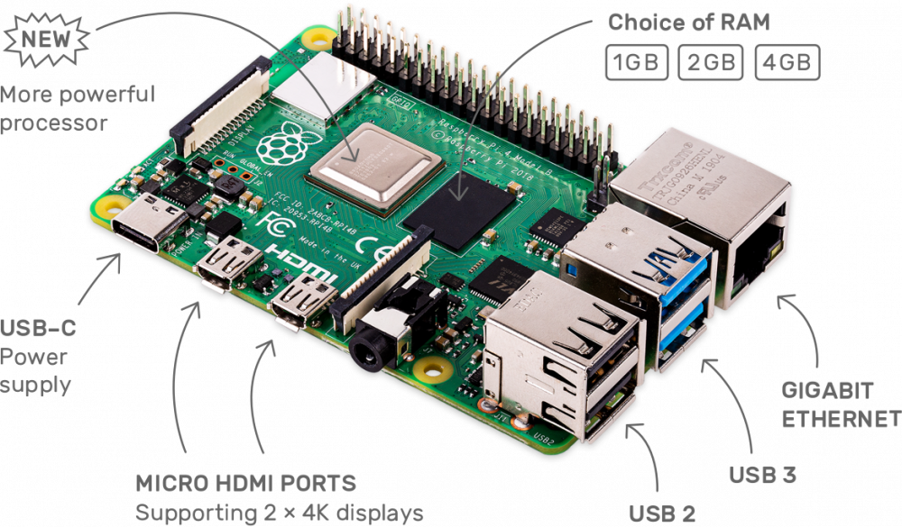
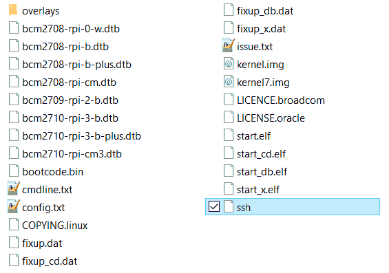

# Introducción

- Setup Raspberry, OpenCV & Tensorflow
- GPIO Program & Hardware interface

---

## Raspberry



- Raspberry Pi 4 es la placa de un ordenador simple compuesto por un SoC, CPU, memoria RAM, puertos de entrada y salida de audio y vídeo, conectividad de red, ranura SD para almacenamiento, reloj, una toma para la alimentación, conexiones para periféricos de bajo nivel ...

- Caracteristicas :

  - 1.5GHz quad-core ARM Cortex-A72 CPU
  - VideoCore VI graphics
  - 4kp60 HEVC decode
  - True Gigabit Ethernet
  - 2 × USB 3.0 and 2 × USB 2.0 ports
  - 2 × micro-HDMI ports (1 × 4kp60 or 2 × 4kp30)
  - USB-C for input power, supporting 5V 3A operation
  - 1GB, 2GB and 4GB LPDDR4 memory SKUs

- Que necesitamos :

  - Fuente USB-C 3amp
  - 32GB microSD
  - Conexion a internet

## Setup Raspberry

- Descargar y ejecutar [Raspberry Pi Imager](https://www.raspberrypi.org/software/)
- Sigue las instrucciones para instalar y ejecutar Raspberry Pi Imager
- Inserta tu SD car en la computadora o laptop
- En el Raspberry Pi Imager, select Other Raspberry Pi OS based images
- Seleccionar Raspberry Pi OS Lite (32-bit)
  Ojo: Necesitas estar conectado a internet la primera vez para descargar el OS.
- Seleccionar SD Card conectada donde se almacenara el OS
- Luego dar click en WRITE
- Retirar la SD de la computadora
- Insertar SD a la computadora
- Habilitar SSH
  - Dentro de el SD agregar el fichero ssh, sin extensión.
  - 
- Configurar Wifi - Dentro de la SD agregar el fichero 'wpa_supplicant.conf' con los siguientes datos:
- ````ctrl_interface=DIR=/var/run/wpa_supplicant GROUP=netdev
     update_config=1
     country=ES
  network={
  ssid="nombre-de-tu-wifi"
  psk="password-de-tu-wifi"
  key_mgmt=WPA-PSK
  }```
  ````
