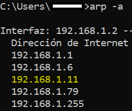

# Introducción

- Setup Raspberry, SSH, Python3
- GPIO Program & Hardware interface

---

## Raspberry


- Raspberry Pi 4 es la placa de un ordenador simple compuesto por un SoC, CPU, memoria RAM, puertos de entrada y salida de audio y vídeo, conectividad de red, ranura SD para almacenamiento, reloj, una toma para la alimentación, conexiones para periféricos de bajo nivel ...

- Caracteristicas :

  - 1.5GHz quad-core ARM Cortex-A72 CPU
  - VideoCore VI graphics
  - 4kp60 HEVC decode
  - True Gigabit Ethernet
  - 2 × USB 3.0 and 2 × USB 2.0 ports
  - 2 × micro-HDMI ports (1 × 4kp60 or 2 × 4kp30)
  - USB-C for input power, supporting 5V 3A operation
  - 1GB, 2GB and 4GB LPDDR4 memory SKUs

- Que necesitamos :

  - Fuente USB-C 3amp
  - 32GB microSD
  - Conexion a internet

---

## Setup Raspberry

- Descargar y ejecutar [Raspberry Pi Imager](https://www.raspberrypi.org/software/)
- Sigue las instrucciones para instalar y ejecutar Raspberry Pi Imager
- Inserta tu SD car en la computadora o laptop
- En el Raspberry Pi Imager, select Other Raspberry Pi OS based images
- Seleccionar Raspberry Pi OS Lite (32-bit)
  Ojo: Necesitas estar conectado a internet la primera vez para descargar el OS.
- Seleccionar SD Card conectada donde se almacenara el OS
- Luego dar click en WRITE
- Retirar la SD de la computadora
- Insertar SD a la computadora
- Habilitar SSH

  - Dentro de el SD agregar el fichero ssh, sin extensión.

    

- Configurar Wifi - Dentro de la SD agregar el fichero 'wpa_supplicant.conf' con los siguientes datos:

```
ctrl_interface=DIR=/var/run/wpa_supplicant GROUP=netdev
update_config=1
country=ES

network={
        ssid="nombre-de-tu-wifi"
        psk="password-de-tu-wifi"
        key_mgmt=WPA-PSK
}
```

- Antes de prender el RPI, abrir el terminal en la computadora conectada a la red configurada
- Ejecutar el comando 'arp -a' para visualizar los dispositivos conectados a la red

  

- Luego encender el RPI y volver a ejecutar el comando 'arp -a' para identificar cual ip se asigno a el RPI

  

---

## Conexión SSH

- Abrir terminal en la computadora y ejecutar el comando 'ssh pi@ip-del-raspberry'
- Escribir 'yes' para continuar con la conexión
- Luego ingresamos el password, por defecto es 'raspberry'

  

---

## Comandos Básicos Linux

- Update & Upgrade software
  ```
  sudo apt-get update
  sudo apt-get upgrade
  ```
- Revisar interfaz de red
  ```
  ifconfig
  ```
- Trabajando con archivos del sistema

  - Lista de contenido en la carpeta actual
    ```
    ls
    ```
  - Listado con detalles
    ```
    ls -lAh
    ```
  - Cambiar o mover de carpeta
    ```
    cd Downloads
    ```
  - Ir a la carpeta home
    ```
    cd ~
    ```
  - Revisar la ruta de la carpeta actual
    ```
    pwd
    ```
  - Crear una carpeta

    ```
    mkdir Test
    ```

  - Crear un archivo
    ```
    touch myfile.txt
    ```
  - Copiar un archivo
    ```
    cp myfile.txt Test
    ```
  - Eliminar un archivo
    ```
    rm Test/myfile.txt
    ```
  - Mover un archivo
    ```
    mv myfile.txt Test
    ```
  - Eliminar una carpeta vacía
    ```
    rmdir Test
    ```
  - Eliminar una carpeta no vacía
    ```
    rm -rf Test
    ```

---

## Setup GPIO (General Purpose Input/Output)

- Ejecutar los siguientes comandos en el terminal del RPI

```
sudo apt-get update
sudo apt-get upgrade
sudo apt-get install python3
sudo apt-get install python3-pip
```

- Instalar y configurar I2C, esto permite al RPI comunicarse con motores, sensores ...

```
sudo apt-get install -y python-smbus
sudo apt-get install -y i2c-tools
sudo raspi-config
```

- Luego seleccionar 'Interfacing Options" -> "I2C" -> 'Yes' -> 'OK' -> 'FINISH'
- Instalar libreria RPI.GPIO

```
sudo pip3 install RPI.GPIO
sudo reboot
```

---

## GPIO PROGRAM

```
python3 blinktest.py
```
